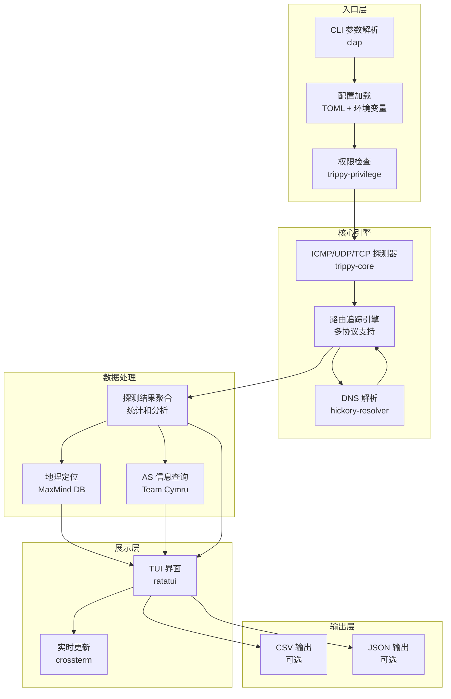

## 项目概述

Trippy 是一个结合了 traceroute 和 ping 功能的网络诊断工具，旨在帮助分析网络问题。它提供了交互式终端用户界面（TUI），支持多种网络协议和高级路由追踪功能。

## 技术栈

| 分类     | 技术                          | 用途                     |
| -------- | ----------------------------- | ------------------------ |
| 编程语言 | Rust (2024 edition)           | 主开发语言               |
| 异步运行时 | Tokio                       | 异步 I/O 和并发处理     |
| 终端 UI  | Ratatui + Crossterm           | 交互式终端界面           |
| 网络协议 | ICMP, UDP, TCP               | 路由追踪和网络探测       |
| DNS 解析 | Hickory-resolver              | 域名解析                 |
| 配置管理 | Toml + Serde                  | 配置文件解析             |
| 错误处理 | anyhow + thiserror            | 错误处理和传播           |
| 测试框架 | mockall + test-case + insta   | 单元测试和快照测试       |
| 构建工具 | Cargo                         | 依赖管理和构建           |

## 项目架构



## 目录结构

```
trippy/
├── AGENTS.md               # LLM行为指南（优先级最高）
├── PROJECT.md              # 项目文档（本文档）
├── Cargo.toml              # 工作空间配置
├── Cargo.lock              # 依赖锁定文件
├── trippy-config-sample.toml # 配置文件示例
├── crates/                 # 核心 crate 集合
│   ├── trippy/             # 主 crate，CLI 入口
│   ├── trippy-core/        # 核心网络探测逻辑
│   ├── trippy-tui/         # 终端用户界面
│   ├── trippy-dns/         # DNS 解析模块
│   ├── trippy-packet/      # 网络包构造和解析
│   ├── trippy-privilege/   # 权限管理
│   └── xdb/                # 扩展数据库支持
├── examples/               # 使用示例
├── docs/                   # 文档站点源码
├── assets/                 # 静态资源（图标、演示等）
├── snap/                   # Snap 包配置
├── ubuntu-ppa/             # Ubuntu PPA 配置
├── .github/                # GitHub Actions CI/CD
├── .devcontainer/          # 开发容器配置
├── Dockerfile              # Docker 镜像构建
├── deny.toml               # 依赖审计配置
├── dprint.json             # 代码格式化配置
├── README.md               # 项目说明
├── CONTRIBUTING.md         # 贡献指南
├── CHANGELOG.md            # 变更日志
├── RELEASES.md             # 发布说明
└── LICENSE                 # Apache-2.0 许可证
```

## 核心模块说明

### trippy-core
核心网络探测模块，实现了 ICMP、UDP、TCP 多种协议的路由追踪功能。包含：
- 探测器实现（ICMP、UDP、TCP）
- 路由追踪引擎
- 探测结果聚合和统计
- 网络包构造和解析

### trippy-tui
基于 Ratatui 的终端用户界面，提供：
- 实时路由追踪显示
- 交互式操作（排序、过滤、详情查看）
- 主题和颜色配置
- 多语言支持

### trippy-dns
DNS 解析模块，支持：
- 系统 DNS 解析
- 自定义 DNS 服务器
- DNS 缓存和并发解析

### trippy-packet
网络包处理模块，包含：
- ICMP/UDP/TCP 包构造
- 包解析和验证
- 校验和计算

### trippy-privilege
权限管理模块，处理：
- 特权提升检查
- 能力（capabilities）管理
- 跨平台权限适配

## 运行方式

### 安装
```shell
# 从 crates.io 安装
cargo install trippy --locked

# 或从源码构建
cargo build --release
```

### 使用
```shell
# 基本路由追踪（需要 root 权限）
sudo trippy example.com

# 无特权模式（使用 capabilities）
trip example.com

# 使用配置文件
trip --config trippy-config-sample.toml example.com
```

## 配置说明

配置文件 `trippy-config-sample.toml` 包含所有可配置选项，主要配置项包括：

- **模式设置**：默认模式（classic/tui）
- **协议设置**：ICMP、UDP、TCP 协议选择
- **DNS 设置**：DNS 解析方式和服务器
- **显示设置**：TUI 界面主题和列显示
- **输出设置**：CSV/JSON 输出格式

## 测试

```shell
# 运行所有测试
cargo test

# 运行特定 crate 测试
cargo test -p trippy-core

# 运行快照测试更新
cargo insta review
```

## 贡献指南

请参考 [CONTRIBUTING.md](CONTRIBUTING.md) 了解贡献流程和代码规范。
